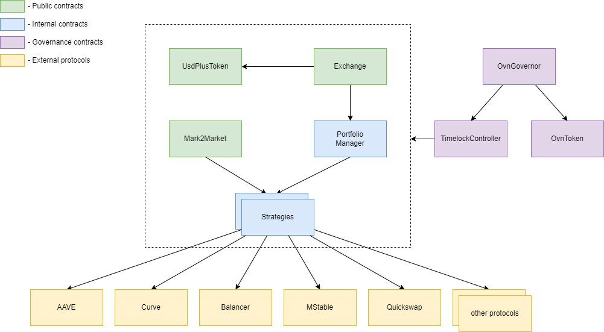

# Ядро системы

Overnight - это протокол DeFi, основанный на USD+, stablecoin с ежедневной выплатой прибыли.

### UsdPlusToken (USD+)

Основной токен протокола. ERC20. Rebased Stablecoin. Содержит индекс ликвидности, отражающий текущее отношение количества выпущенных 
USD+ токенов к объему активов на стратегиях (`Strategy`), выраженному в USDC. Внутри балансы хранятся в RAY (используется `WadRayMath`), что позволяет 
не беспокоиться о точности работы с балансами при mint/redeem/balanceOf. Корректировка индекса ликвидности происходит при запуске процесса
выплат на `Exchange.payout()` от имени `Exchange`. Доступ к `mint()` и `redeem()` доступен только `Exchange`.

Публичны метод `exchange()` можно использовать для получения актуального адреса `Exchange` для выполнения обмена.   

### Exchange 

Основная точка входа для клиентов. Не является держателем активов.

Содержит три метода, доступных для внешнего вызова без модификаторов доступа: 
- `buy` - позволяет клиенту обменять свои USDC на USD+. Полученные USDC передаются на `PortfolioManager`, где будет запущен механизм по распределению 
  полученных активов по заданным стратегиям.
- `redeem` - позволяет клиенту обменять свои USD+ обратно на USDC. При необходимости запускается процесс на `PortfolioManager`, 
  где происходит изъятие необходимого для возврата объема USDC.
- `payout` - позволяет запустить расчёт и выплату вознаграждений для всех держателей USD+. Производится получение доходов по стратегиям, 
  после чего корректируется индекс ликвидности на `UsdPlusToken` относительно объема активов на стратегиях (`Strategy`).

### PortfolioManager

Содержит логику по распределению активов между стратегиями.
Является держателем информации по целевым весам `strategyWeights` по используемым стратегиям.
При необходимости выполняет процесс перераспределения активов с использованием метода `balance`.
Не является держателем активов.

Содержит три метода, доступных только для роли `EXCHANGER`:
- `deposit` - получает активы и помещает их в `cashStrategy` до достижения лимита. Если лимит превышен, то распределяет на все стратегии согласно
  целевым весам, запуская балансировку
- `withdraw` - изымает активы из стратегий для возврата клиенту. Если в `cashStrategy` достаточно активов, то использует их, а иначе
  запускает балансировку с изъятием из стратегий необходимого объема активов
- `claimAndBalance` - запускает сбор (claiming) вознаграждений по стратегиям с последующей балансировкой портфеля к целевым значениям

Также есть методы управления, доступные для роли `ADMIN`:
- `balance` - запуск балансировки активов между стратегиям для соответствия заданным целевым значениям
- `setStrategyWeights` - настройка целевых значений для стратегий
- `setCashStrategy` - назначает какую стратегию использовать в качестве `cashStragegy` - которая является буфером для активов,
  предотвращающим постоянные балансировки

### Mark2Market

Предоставляет функционал получения информации о текущих активах под управлением стратегий и их стоимости в USDC. 
Информацию о стоимости каждого актива в USDC предоставляют стратегии самостоятельно. 

Имеет следующие общедоступные методы:
- `strategyAssets` - получение сводной таблицы по стоимости текущих активов, управляемых стратегиями
- `totalNetAssets` - общая стоимость активов в USDC под управлением всех стратегий
- `totalLiquidationAssets` - потенциальный объем USDC, который можно получить при полном выводе активов со всех стратегий 

### Connectors 

Коннекторы к протоколам, в которые вкладываются активы.
Содержат логику по взаимодействию стратегий с подключаемыми внешними протоколами.

### Strategies

Множество контрактов, содержащих стратегию по управлению активами. Являются держателями активов.

Расширяют и дополняют `Strategy` - родительский контракт с базовой логикой и интерфейсом для управления через `PortfolioManager`.
Имеют несколько публичных методов, доступных для роли `PORTFOLIO_MANAGER`:
- `stake` - метод для внесения активов под управление стратегией 
- `unstake` - метод вывода активов из-под управления стратегии. Позволяет сделать частичный либо полный вывод активов
- `netAssetValue` - текущий объем активов под управлением в эквиваленте USDC
- `liquidationValue` - текущий потенциальный объем активов в эквиваленте USDC, который можно получить при полном выводе
- `claimRewards` - запускает сбор вознаграждений, если такое предусмотрено стратегией 

# Управление (governance)

Модуль системы, который содержит логику для организации DAO.

### OvnGovernor

Основной контракт, который содержит логику управления.
Дает возможность вносить предложения на изменения протокола, контролирует процесс голосования.

За основу взят код от: openzeppelin

### OvnToken (OVN)

Governance токен, который позволяет носителям участвовать в управление.

За основу взят код от: openzeppelin

### TimelockController 

Занимается выполнением предложений, которые успешно прошли голосование в OvnGovernor.
Является владельцем (owner) всех остальных контрактов системы.

За основу взят код от: openzeppelin
